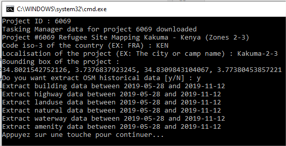
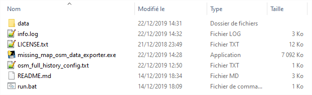

# Missing Maps OSM data exporter
> Tool to export OSM data for Missing Maps projects

### Basic Installation

#### Windows

- [Download the archive for the Windows version](https://github.com/NicolasGrosjean/Missing_Maps_OSM_data_exporter/releases/download/v1.2.0/Missing_Map_osm_data_exporter_1_2_0_Windows.zip)
- Extract the archive

*Tested on Windows 10*

#### Linux

- [Download the archive for the Linux version](https://github.com/NicolasGrosjean/Missing_Maps_OSM_data_exporter/releases/download/v1.2.0/Missing_Maps_osm_data_exporter_1_2_0_Linux.zip)
- Extract the archive

*Tested on Ubuntu 18_04 LTS*

#### Mac
Try the Linux installation, otherwise try the contributor installation.

### Contributor Installation

If you want contribute to the project or if the basic installation fails,
this section is for you.

I recommend you to install a Python environment with conda or virtualenv.

##### Conda
For example with conda, 
[download and install miniconda](https://docs.conda.io/en/latest/miniconda.html)

Create a conda environment
```
conda create -n mm_osm python=3.7.1
```

Activate the conda environment
```
activate mm_osm
```

Install the packages with the following commands
```
conda install geojson requests
```

If the installation fails you can pass by pip
```
pip install geojson
pip install requests
```

##### Optionnal

If you want release your development, you can use the Pyinstaller package.

````
pip install pyinstaller
````

To release, run the following command
````
pyinstaller src/console_gui.py -F
````

## Usage

### With basic installation

**Windows** : Double-click on *run.bat*.
A console opens, follow the instructions written after the Linux description.

**Linux** : Open a terminal in the installed directory.
Run the command ```./Missing_Maps_exporter```

**Both** :

* Gives a [HOT tasking manager project ID](https://tasks.hotosm.org/contribute), type it and press Enter
* The console tells you if the data are downloaded or previous downloaded will be used
* The console show you the name of the project.
In case you have done a mistake in the project id, tou can do Ctrl+C to leave the console
* The console asks you the ISO-3 code of the country to use it in file names.
For Kenya it is KEN.
You can find it in [this website](https://fr.actualitix.com/blog/annexes/code-iso-2-et-iso-3-des-pays.php) for example.
* The console asks you the localisation to also put it in file names.
You can use come information from the name of the project already displayed.
It is better to use dash (-) instead of spaces between words.
* The console gives you the bounding box of the project and you have now a perimeter file of the project
* The console asks you if you want in addition an extraction of the historical OSM data between
the beginning of the project and the latest date (generally 40 days ago).
This extraction is configurable (see lower).
If you want it, type *y* and press Enter. Otherwise simply press Enter (*N* for no is the default choice)
* The console asks you if you want extract data info the exact perimeter (useful for stats)
or if you want to extract data according a bounding box (to have more map context).
Press *y* for exact perimeter, another thing (for example *N*) for bounding box
* If you choose the bounding box, the console asks you  if you want increase the
bounding box by a percent of its surface to have more context.
For example type *20* to increase the surface of 20% or 0 to do not increase.
* The console asks you the beginning date of the extraction.
The default date is the creation date of the project. If you want it simply press Enter.
Otherwise, type a date respecting the same format *YYYY-MM-DD*
* The console shows you the date of the latest edit on the project and the latest date available with ohsome.
The console asks you the end date of the extraction.
The default date is the latest date available with ohsome. If you want it simply press Enter.
Otherwise, type a date respecting the same format *YYYY-MM-DD*
* The console shows you feedback on the current downloading task

At the end of the processing you will have something like this



Copy-paste somewhere the bounding box of the project.

In case the console is closed before you copy-pasted it,
you can restart the instructions of this section to get it again.

To close the console, as printed, pressed a key in the keyboard.

In the directory of your installation, you will see new elements :
* info.log : logs about the application. Send to us in case of issues.
* data : the directory containing all the download data.
In particular for each project you have asked there is a subdirectory with all
the related data (the perimeter for example).



**To use the bounding box and/or the perimeter to download related OSM data,
see [this tutorial](https://github.com/NicolasGrosjean/Missing_Maps_OSM_data_exporter/wiki/Download-current-OSM-data-of-a-Missing-Maps-project).**

To change the downloaded OSM historical data, you can modify *osm_full_history_config.txt* file with a text editor.
Each line contains the tag (EX: building) and the geometry wanted (EX: polygon).
The geometry is optional, you can put nothing to have all geometries.

**To use the downloaded OSM historical data, see [this tutorial](https://github.com/NicolasGrosjean/Missing_Maps_OSM_data_exporter/wiki/Use-historical-OSM-data-of-a-Missing-Maps-project)**

### With contributor installation

Activate the conda environment if you have installed with it
```
activate mm_osm
```

Run the following script
```
python src/console_gui.py
```

The rest is the same as the previous section.

## Tests (with contributor installation)

Go to the tests directory and run unittest
```
cd tests
python -m unittest discover
```

## Licence

The project have an Apache-2.0 licence because of the inclusion of
[overpass python library](https://github.com/mvexel/overpass-api-python-wrapper) which has this licence.
