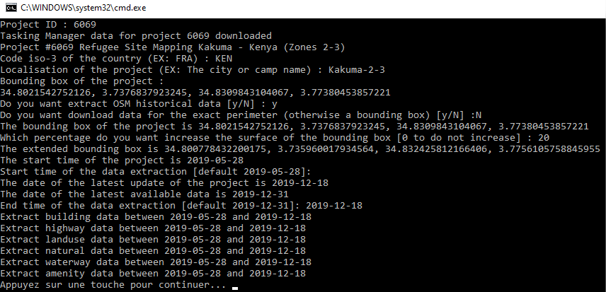

# Missing Maps OSM data exporter
> Tool to export OSM data for Missing Maps projects

### Basic Installation

#### Windows

- [Download the archive](https://github.com/NicolasGrosjean/Missing_Maps_OSM_data_exporter/releases/download/v1.0.0/Missing_map_osm_data_exporter_1_0_0.zip)
- Extract the archive

#### Linux/Mac

See contributor installation section

### Contributor Installation

If you want contribute to the project or if the basic installation fails,
this section is for you.

I recommend you to install a Python environment with conda or virtualenv.

##### Conda
For example with conda, 
[download and install miniconda](https://docs.conda.io/en/latest/miniconda.html)

Create a conda environment
```
conda create -n mm_osm python=3.7.1
```

Activate the conda environment
```
activate mm_osm
```

Install the packages with the following commands
```
conda install geojson requests
```

##### Optionnal

If you want release your development, you can use the Pyinstaller package.

````
pip install pyinstaller
````

To release, run the following command
````
pyinstaller src/console_gui.py -F
````

## Usage

#### With basic installation

Double-click on *run.bat*

A console opened and asks you a Hot tasking manager project ID



Type 4416 and Enter for example.

At the end of the processing you will something like this


Copy-paste somewhere the bounding box of the project.

In case the console is closed before you copy-pasted it,
you can restart the instructions of this section.

To close the console, as printed, pressed a key in the keyboard.

In the directory of your installation, you will see new elements :
* info.log : logs about the application. Send to us in case of issues.
* data : the directory containing all the download data.
In particular for each project you have asked there is a subdirectory with all
the related data (the perimeter for example).


**To use the bounding box and/or the perimeter to download related OSM data,
see [this tutorial](https://github.com/NicolasGrosjean/Missing_Maps_OSM_data_exporter/wiki/Download-OSM-data-of-a-Missing-Maps-project).**

#### With contributor installation

Activate the conda environment if you have installed with it
```
activate mm_osm
```

Run the following script
```
python src/console_gui.py
```

The rest is the same as the previous section.

## Tests (with contributor installation)

Go to the tests directory and run unittest
```
cd tests
python -m unittest discover
```

## Licence

The project have an Apache-2.0 licence because of the inclusion of
[overpass](https://github.com/mvexel/overpass-api-python-wrapper) which has this licence.